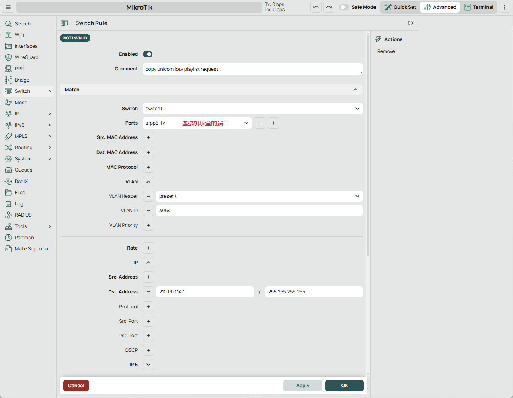
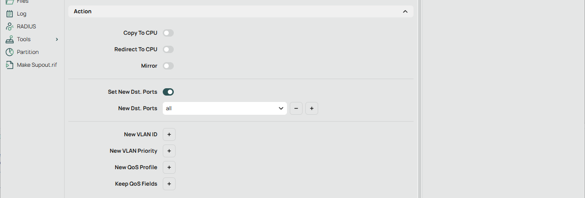

# 北京联通 IPTV 节目单嗅探工具

~~北京联通IPTV节目单嗅探工具是一款具备自主知识产权和突破技术封锁的创新产品，为用户提供更广泛的频道选择和更高质量的服务。本工具成功地突破了美国的技术封锁，实现了对IPTV频道列表的自主获取。这意味着北京联通IPTV用户可以自由地获取频道列表，无需受制于网络限制。其次，我们的产品注重自主知识产权的保护，通过自主研发和创新，我们实现了对IPTV频道列表的完全掌控，确保用户的权益和信息安全。此外，本工具还实现了技术上的自主创新突破。我们不断追求技术的进步和突破，以提供更好的用户体验和更高的服务质量。~~

不再依赖他人更新的节目单，机顶盒每次启动时工具嗅探到新的 `user_token` 后自动执行节目单更新，实现节目单自由！

## ⚖️ 法律声明

**使用本项目前请务必阅读[免责声明](DISCLAIMER.md)。**

本项目采用 [AGPLv3](LICENSE) 许可协议开源。

## 准备工作

1. 将机顶盒流量转发至执行脚本的机器(交换机ACL或镜像口)，不同交换机有不同配置，以下仅供参考。

### Router OS 镜像配置示例

* Switch -> Rule -> New

* Action

### SwOS Lite 镜像配置示例

2. 开启混杂模式

## 大概的使用说明
1. 复制 `config.example.json` 到 `config.json`，修改里面需要改的路径
2. 复制 `tvg_mapper.example.json` 到 `tvg_mapper.json`，该文件的作用是覆盖最终节目单中的一些EPG信息，可以不要
3. 把 `systemd` 文件夹中的服务都装上，注意可能需要修改路径，sniffer服务要root用户执行，其他自己试，大概不用非得root
4. `crontab -e` `0 2 * * * /usr/bin/python3 /root/beijing-unicom-iptv-playlist-sniffer/epg.py > /root/beijing-unicom-iptv-playlist-sniffer/epg.log 2>&1`

未完待续......

## 致谢

本项目台标资源来源于互联网，部分台标资源来源于 [老张的EPG](http://epg.51zmt.top:8000/) 和 [wanglindl/TVlogo](https://github.com/wanglindl/TVlogo) 项目，在此向项目维护者表示感谢。

## TODO
- [x] ~~抓EPG~~
- [ ] 写详细的使用说明
- [x] ~~发布节目单~~: https://github.com/zzzz0317/beijing-unicom-iptv-playlist/
