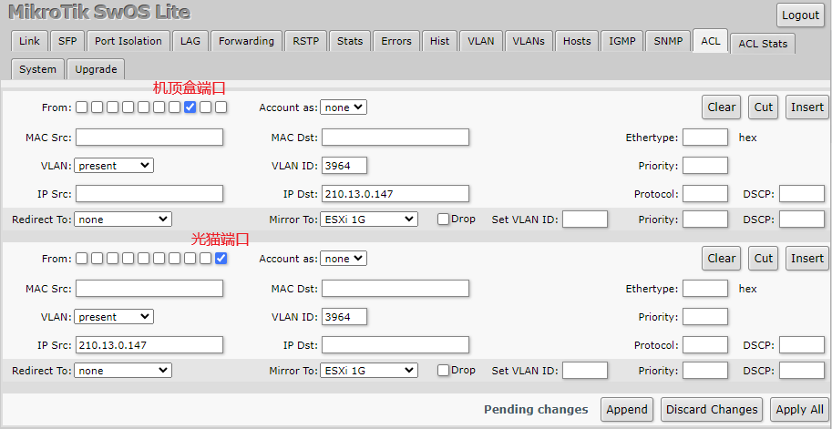

# 北京联通IPTV节目单嗅探工具
不再依赖他人更新的节目单，机顶盒每次启动时工具嗅探到新的 `user_token` 后自动执行节目单更新，实现节目单自由！

## 准备工作
1. 将机顶盒流量转发至执行脚本的机器(交换机ACL或镜像口)，以下使用 CSS610 做示范

2. 开启混杂模式

未完待续......

## TODO
- [ ] 抓EPG
- [ ] 写详细的使用说明
- [ ] 发布节目单